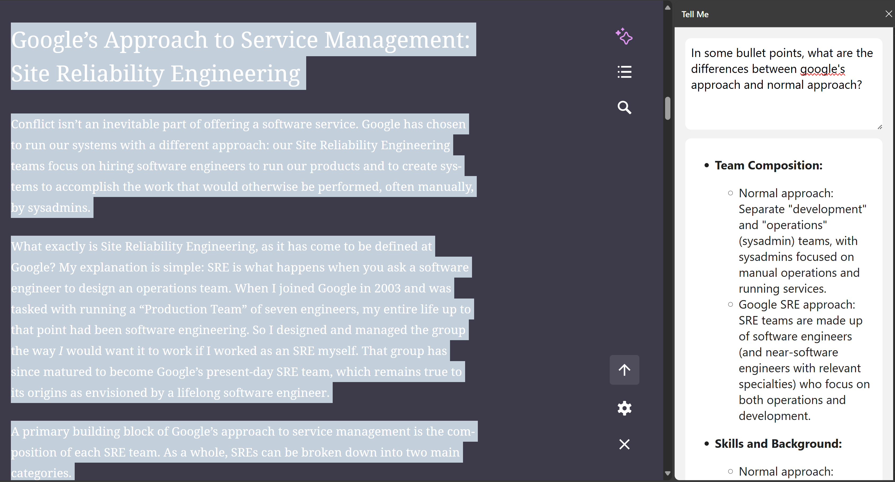

# Tell Me

A Chrome extension to ask questions based on selected text.



How to run:

1. Build the extension:
   
   ```sh
   $ cd extension
   $ npm install
   $ npm run build
   ```

   Upload to Chrome/Edge: from browser, click on "Manage extensions", then "Load unpacked". Select the build artifact `dist` folder.

2. Run backend:

   You need to have the OpenAI API key set first. Create a `.env` file at the root of this directory, with content like this:

   ```
   OPENAI_API_KEY=sk-...
   ```

   Then start the server:

   ```sh
   $ fastapi dev backend.py
   ```

   Note you need to install some dependencies first in the environment.